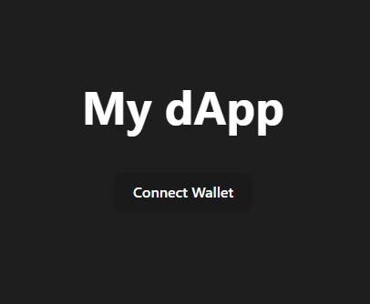
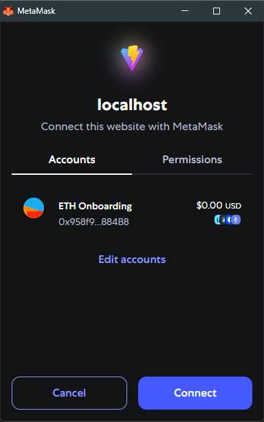
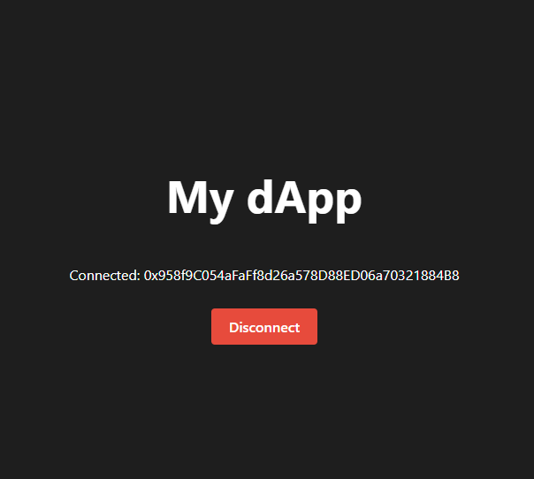

# Connecting a Wallet (MetaMask)

Now that your frontend is set up, the next step is to connect your dApp to a user's wallet. In this section, you’ll integrate **MetaMask** using `ethers.js` so that users can authenticate and sign transactions.

Connecting a wallet is the entry point to user interaction in Web3 — without it, your dApp can’t access accounts or send signed transactions.

---

## 🧩 Why MetaMask?

MetaMask is one of the most widely used wallets in the Ethereum ecosystem. It allows users to:

- Manage their Ethereum accounts and sign transactions
- Connect to dApps through browser extensions
- Easily switch between networks like Mainnet, Goerli, or Sepolia

> ✅ You should have MetaMask and a wallet created at this point before continuing.

---

## 📦 Installing Dependencies

In order to interact with Ethereum wallets and smart contracts, we’ll use the [`ethers.js`](https://docs.ethers.org/) library.

From your project directory (`my-dapp/`), run the following:

```bash
npm install ethers
```

> 🧩 `ethers` is the JavaScript library that allows your frontend to interact with Ethereum smart contracts and wallets.


---

## 🔌 Connecting to MetaMask

Replace the content of your `App.jsx` file with the following example:


```jsx
import { useState } from 'react';
import { ethers } from 'ethers';

function App() {
  const [account, setAccount] = useState(null);

  async function connectWallet() {
    if (window.ethereum) {
      try {
        const provider = new ethers.BrowserProvider(window.ethereum);
        const signer = await provider.getSigner();
        const address = await signer.getAddress();
        setAccount(address);
      } catch (err) {
        console.error('User rejected the connection', err);
      }
    } else {
      alert('MetaMask not found. Please install it.');
    }
  }

  return (
    <div>
      <h1>My dApp</h1>
      {account ? (
        <>
          <p>Connected: {account}</p>
          <button
            onClick={() => setAccount(null)}
            style={{ backgroundColor: '#e74c3c', color: 'white' }}
          >
            Disconnect
          </button>
        </>
      ) : (
        <button onClick={connectWallet}>
          Connect Wallet
        </button>
      )}
    </div>
  );
}

export default App;

```


Once you save the file and refresh your browser, you should see a “Connect Wallet” button.



If MetaMask is installed, it will prompt the user to connect their wallet:



After connecting, the wallet address should be displayed along with a “Disconnect” button:



---

### 🔍 What’s happening in the code?

- `window.ethereum`: This object is injected by MetaMask into the browser. It allows your dApp to request access to the wallet.
- `ethers.BrowserProvider(window.ethereum)`: Wraps MetaMask’s provider into an object compatible with `ethers.js`.
- `getSigner()`: Retrieves the wallet’s signer — a representation of the user’s Ethereum account.
- `getAddress()`: Extracts the public address (e.g., `0xabc...`) of the connected wallet.
- `setAccount(address)`: Updates the React state so the UI can reflect the connection.

This is a minimal yet functional example of wallet connection using the official browser API.

---

## 📌 Understanding “Disconnect”

When you click the **“Disconnect”** button, it clears the connected wallet address from your app’s state. This updates the interface and removes the wallet info from the screen.

However, it’s important to understand that **MetaMask still considers your dApp connected** in the background. That’s why, if you refresh the page or connect again, MetaMask won’t show the popup — the connection is already authorized.

This behavior is expected in most dApps. MetaMask manages trust on its side, and developers can't force a full disconnect programmatically. To fully revoke access, the user must go to:

> **MetaMask → Settings → Connected Sites → \[Remove this site]**

> 🧠 This is not a bug — it's part of MetaMask’s security model.

---

## 🧠 Reflect

**Why is user authentication different in Web3 compared to Web2?**
<details markdown="1">
<summary>💡 Reveal answer</summary>
Web3 uses public-private key pairs instead of email/password. Users prove ownership by signing data with their wallet.
</details>

**What security risks arise if you automatically connect wallets without user interaction?**
<details markdown="1">
<summary>💡 Reveal answer</summary>
It could expose user addresses without consent. Always request connection explicitly to respect privacy and avoid phishing.
</details>

---

<div class="module-progress"
     role="progressbar" aria-valuemin="0" aria-valuemax="100" aria-valuenow="0"
     data-scopes='["mod4-intro","mod4-react","mod4-wallet","mod4-integracion","mod4-actividad","mod4-cierre"]
'>
  <div class="mp-header">
    <strong>Módulo 4: Progreso</strong>
    <span class="mp-percent" aria-live="polite">0%</span>
  </div>
  <div class="mp-bar"><div class="mp-bar-fill" style="width:0%"></div></div>
</div>

<div class="page-done" data-scope="mod4-wallet" style="margin:.75rem 0 1.25rem">
  <label class="pd-label">
    <input type="checkbox">
    <span class="pd-text">Marcar esta página como completada</span>
  </label>
</div>

<style>
  .module-progress{background:#fff;border:1px solid #e5e7eb;border-radius:12px;padding:1rem;margin:1rem 0;box-shadow:0 1px 2px rgba(0,0,0,.04)}
  .mp-header{display:flex;justify-content:space-between;align-items:center;margin-bottom:.5rem;color:#374151;font-weight:600}
  .mp-percent{color:#6b7280;font-weight:600}
  .mp-bar{height:12px;background:#e5e7eb;border-radius:999px;overflow:hidden}
  .mp-bar-fill{height:100%;width:0;transition:width .25s ease;background:#22c55e}
  .pd-label{font-weight:600;color:#374151}
  .pd-help{color:#6b7280;font-size:.875rem;display:block;margin-top:.25rem}
</style>

<script defer src="{{ '/assets/js/progreso.js?v=1.2' | relative_url }}"></script>

---

### 🔁 Navegación

<div style="display: flex; justify-content: space-between; margin-top: 2em;">
  <a class="btn" href="/Testing-Onboarding/modulo4/modulo4-2">⬅️ Anterior</a>
  <a class="btn" href="/Testing-Onboarding/modulo4/modulo4-4">Siguiente ➡️</a>
</div>
